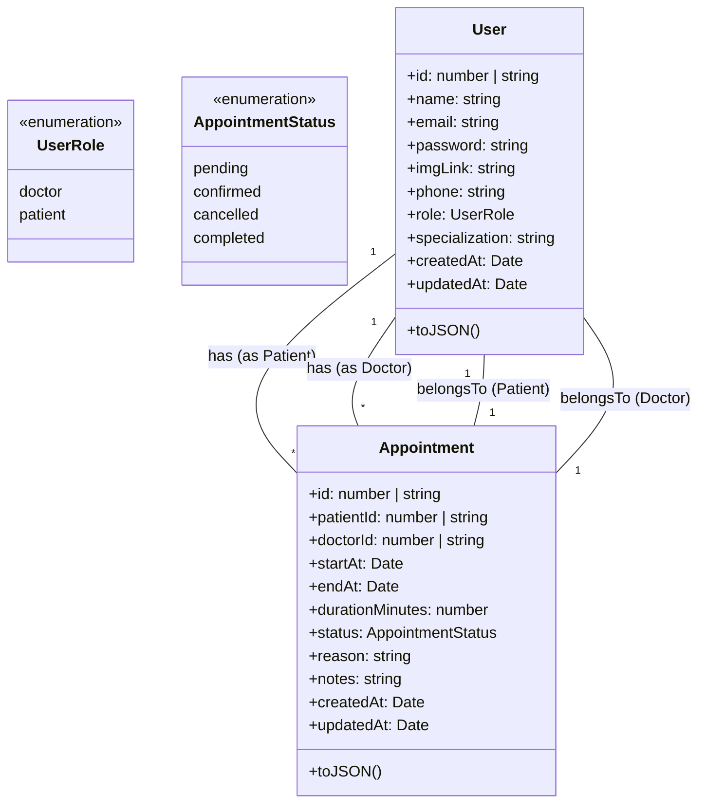
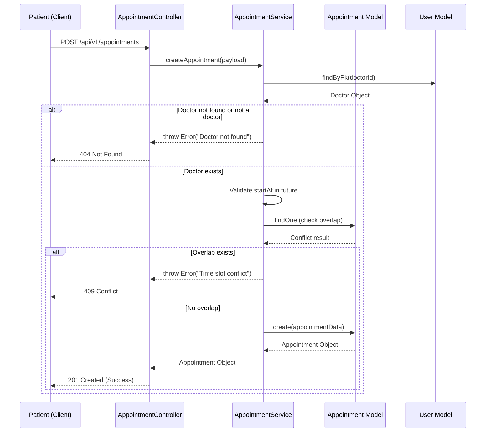

# Clinic Server UML Documentation

This document provides a visual representation of the Clinic Server's architecture, data models, and key business processes using Mermaid diagrams.

## 1. Class Diagram (Domain Models)

The following diagram shows the core entities of the system: `User` and `Appointment`, including their attributes, types, and relationships.



## 2. Sequence Diagram (Create Appointment)

This diagram illustrates the process of creating a new appointment, showing the interaction between the API layer, service layer, and persistence layer.



## 3. High-Level Architecture

The system follows a typical Controller-Service-Model architecture pattern.

```mermaid
graph TD
    Client[Client Application] --> Routes[Express Routes]
    Routes --> Controllers[Controllers]
    Controllers --> Middlewares[Middlewares (Auth, Validation)]
    Controllers --> Services[Services (Business Logic)]
    Services --> Models[Models (Sequelize)]
    Models --> DB[(PostgreSQL Database)]
```
